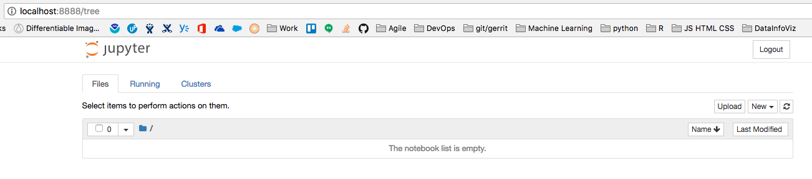
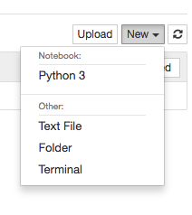

# A Jupyter Python seed notebook for data processing

See [section below](#quick-get-started-with-jupyter-notebooks) if you are not familiar with Jupyter notebooks.

This is a seed for [Jupyter](http://jupyter.org/) notebooks that read, manipulate and visualize data.

It covers:

* Read data from an external file
* Manipulate the data
  * Create new columns based on the values of columns in the file
* Filter data based on column values
* Visualize data in a graph

## References

Some links I used to create the notebook:

* https://towardsdatascience.com/exploratory-data-analysis-with-pandas-and-jupyter-notebooks-36008090d813
* https://jeffdelaney.me/blog/useful-snippets-in-pandas/
* https://pandas.pydata.org/pandas-docs/stable/tutorials.html
* https://pandas.pydata.org/pandas-docs/stable/cookbook.html

# Quick "get started with Jupyter notebooks"

## Installing and using Jupyter notebooks

### Installing and running the Jupyter engine

Official installations instructions [here](http://jupyter.org/install.html).

The gist of it:

    python3 -m pip install jupyter
 
Once installed, run Jupyter:

    jupyter notebook

This opens your default browser with the entry page for Jupyter.

### Creating a notebook

Click on "New" and Choose "Python 3"

Give it a name: click on the "Untitled" text and change to the name you want:

A file with that name and the extension `.ipynb` is created in the directory from where you executed `jupyter notebook`.

### Working with notebook

See the [basics of working with a notebook](https://jupyter-notebook.readthedocs.io/en/stable/examples/Notebook/Notebook%20Basics.html) in the Jupyter docs for a five-minute introduction.

After that, learn how to add cells to the notebook. Cells can have [code](https://jupyter-notebook.readthedocs.io/en/stable/examples/Notebook/Running%20Code.html#) or [text](https://jupyter-notebook.readthedocs.io/en/stable/examples/Notebook/Working%20With%20Markdown%20Cells.html).

### Saving the notebook

Jupyter notebooks are autosaved every two minutes (the default value - see [here](https://www.webucator.com/blog/2016/03/change-default-autosave-interval-in-ipython-notebook/) how to change it).

The save command (`Ctrl-S` or the disk button in the toolbar) save the notebook immediately.
Remember to manually saving before committing to source control, or the notebook will 
be missing the last two minutes or so of the work you did.

Manually saving files create checkpoints that you can revert back to later. However,
it's often better to use source control with frequent commits for that purpose. See the next section.

### Adding version control

Notebooks are text files and can (should) be under version control. 

To use version control (with Git in this case), first initialize Git on the directory where your notebook is located (the `.ipynb`file):

    git init

The step below is needed only if you don't plan to use checkpoints (a point in time you can revert to later). Usually version control replaces checkpoints, but nothing prevents you from using both. Skip that step if you plan to use manual checkpoints together with version control.

Remove the checkpoints from the list of tracked files

    echo ".ipynb_checkpoints" >> .gitignore

Commit a first version of the work so far:

    git add .
    git commit -m "Initial commit"
    
Now start making changes and commit them frequently.

**IMPORTANT:** The notebook file has exactly what you see on screen. If you ran cells, the output of those cells is also saved on the file. This may make the file larger than needed and make diffs harder to follow. Use Kernel > "Restart & Clear Output" before saving to remove the output, leaving only the text and code cells in place.

# License

This project is licensed under the MIT License - see the [LICENSE.md](LICENSE.md) file for details
